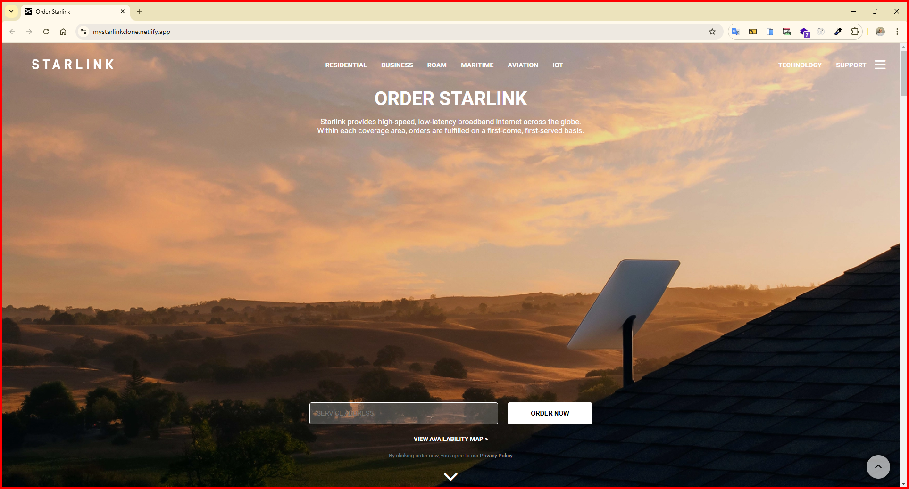
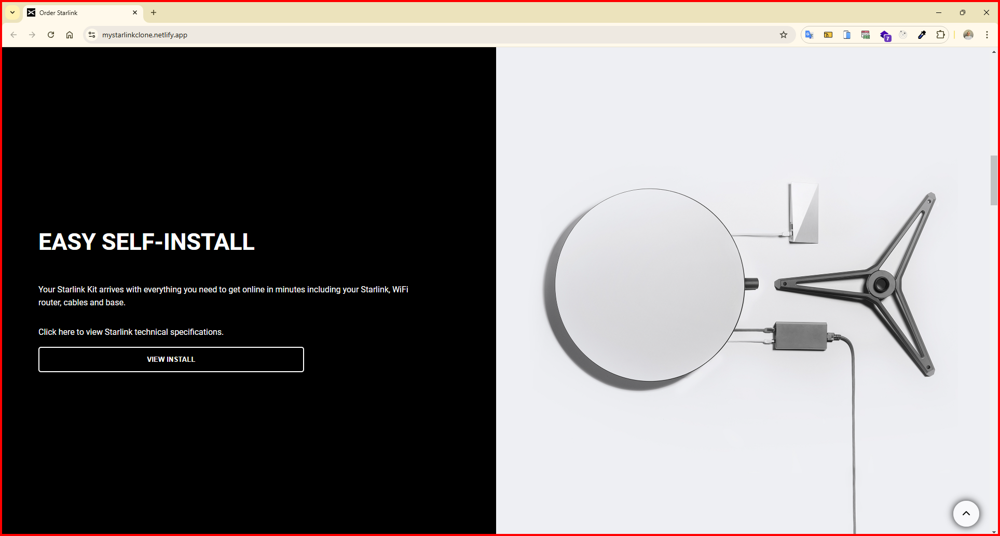
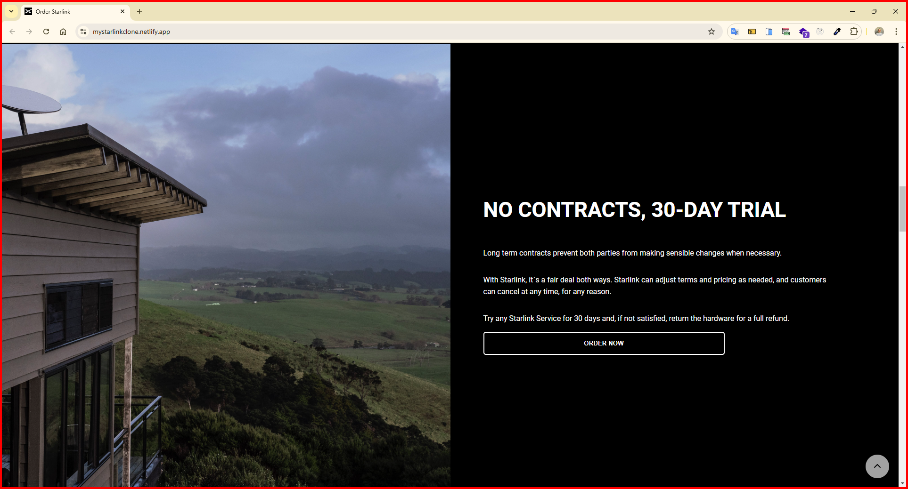
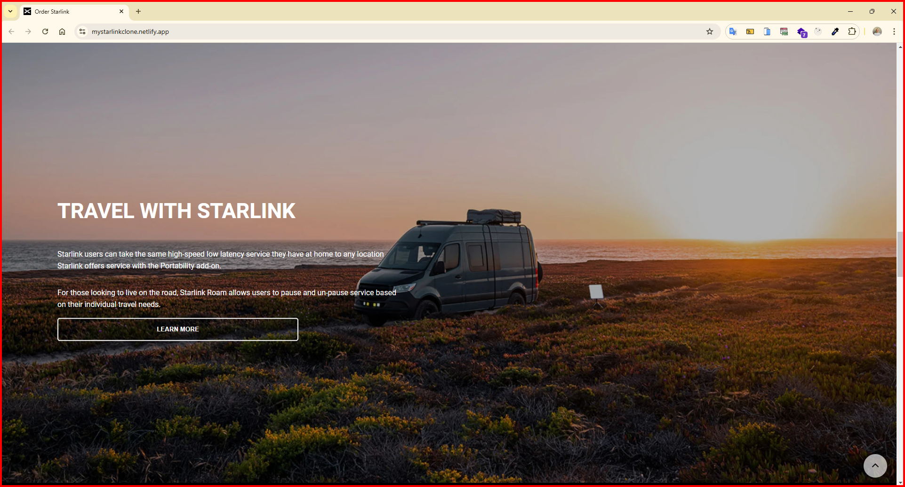

<h1>Starlink Clone Website</h1>

I am here with a clone site that captures the design lines of Starlink 2023 website! Discovering Starlink products is now much more enjoyable on this site, which I created with HTML5 and SCSS mastery.

<h2> The following technologies were used in the frontend development phase of my site: </h2>

- HTML5
- SCSS

<h2> Visit My Starlink Clone Website: </h2>

- https://mystarlinkclone.netlify.app/

<h4>IMAGES</h4>

